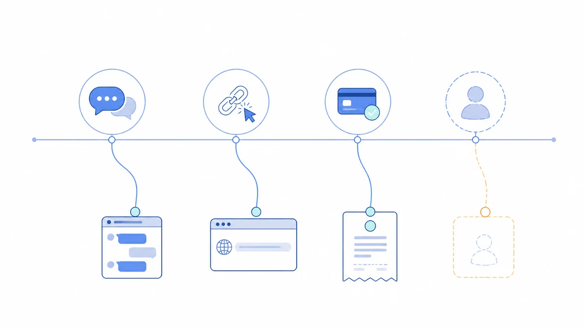

# Financial Cyber Fraud Reporting Guide

  

  A bilingual, citizen-first guide for preparing a financial cyber-fraud report before continuing on official channels.

  <a href="https://thread-zero.vercel.app/">Explore the live prototype</a>
  ·
  <a href="docs/participation/README.md">Read the participation record</a>
  ·
  <a href="CONTRIBUTING.md">Contribute</a>

> **For an actual financial cyber-fraud incident in India:** call **1930** manually and use [cybercrime.gov.in](https://cybercrime.gov.in/) manually. This project is an independent demo: it does not call, submit, upload, or contact anyone for you.

## Why ThreadZero exists

Financial cyber fraud often leaves people with fragments: a message, a suspicious link, a payment receipt, a phone number, and a fast-moving timeline. ThreadZero helps turn those fragments into a calmer, structured preparation path before the citizen continues through the real official process.

It is deliberately not an NCRP, police, bank, payment-provider, or government service. The guide explains what a person can prepare; official channels handle the real report.

## A guided preparation path

| 01. Understand | 02. Organise | 03. Continue |
| --- | --- | --- |
| Choose the situation and get urgent manual 1930 guidance when money is at risk. | Add useful facts, evidence, and a timeline without making missing information a failure. | Review the prepared summary, keep the demo boundary clear, and open the appropriate official destination yourself. |

  

## What is inside

ThreadZero has six connected workspaces:

| Workspace | What it helps with |
| --- | --- |
| **Home** | Orientation, incident timeline, services, evidence context, and next steps. |
| **Report** | A five-stage flow: What happened? → Details → Evidence → Timeline → Review & next. |
| **Check** | Practical guidance for people/accounts, websites/apps, mobile/SIM, platform abuse, suspect reporting, and appeals. |
| **Track** | Local preparation progress and a deterministic browser-saved demo reference tracker. |
| **Learn** | Situation-first tasks, selected official advisories, resources, and references. |
| **Help** | Urgent 1930 guidance before FAQ, feedback, escalation, and official destinations. |

All reporting, tracking, extraction, and submission behavior is deterministic demo behavior. There is no backend, authentication, database, upload, OCR, analytics, model call, or external write integration.

## Built for Build What Moves India

ThreadZero was prepared for **Build What Moves India** on **29 August 2026**. That event record remains part of the project’s history; it is not a claim of current participation.

- [Historical submission packet](SUBMISSION_PACKET.md) — original project summary, recording script, and verification snapshot.
- [Participation record](docs/participation/README.md) — current A–Z project record, evidence checklist, and fields that must be confirmed for a future event.

## Technology and safety

- Next.js 16 static export, React 19, TypeScript, and Bun 1.3.14.
- Active application source lives in src/; public assets live in public/; the release export is out/.
- Vercel and Netlify configurations apply restrictive browser security policies, including no external connections from the application, frame denial, and immutable static-asset caching.
- Historical site/, core/, V3/V4 records, and tools/build-static.mjs are retained for provenance and are not the active deployment runtime.

## Run it locally

    bun install --frozen-lockfile
    bun run dev

Then open http://localhost:3000.

Before opening a pull request, run:

    bun run typecheck
    bun run test
    bun run build

## Project records

- [Contributing guide](CONTRIBUTING.md)
- [Project rules](AGENTS.md)
- [V5 current-state record](THREADZERO_CURRENT_STATE_V5.md) — historical record from 29 August 2026
- [Historical Build What Moves India packet](SUBMISSION_PACKET.md)
- [Current participation record](docs/participation/README.md)

## Public repository status

This repository is public and the live prototype is deployed. The remaining governance work is documented openly: choose a licence, add a monitored security disclosure contact, continue reviewing Git history and asset provenance, and confirm any future event details against that organiser’s official rules.
