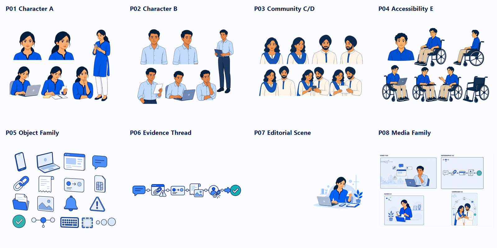

# ThreadZero Illustration System v1.0 — Final Lock

> **Historical evidence only.** Superseded for active V3 implementation by `ILLUSTRATION_RESET_01.md`. P01–P04 remain identity references; P05–P08 are rejected exploration.

- **Decision:** APPROVED AND FROZEN
- **Lock date:** 2026-08-28
- **Implementation authority:** `THREADZERO_V3_DESIGN_DRAFT/proofs/approved/`
- **Review evidence:** `proofs/review/P01-P08-illustration-v1-approval-board.png`
- **Website implementation:** not started by this lock

## Approved masters

| Proof | File | Dimensions | Format | SHA-256 |
|---|---|---:|---|---|
| P01 | `proofs/approved/P01-character-a-master-v1.png` | 1448×1086 | 4:3 ARGB | `9B0C18EDAEC8D5698B2E3018F8B5D6564F8862CA2DC9C783525D87B17F4BF1E2` |
| P02 | `proofs/approved/P02-character-b-master-v1.png` | 1448×1086 | 4:3 ARGB | `5D2F30D132E0D4D942A46D0C3BE6DEB3F7F1DB9BF6F3B8AD94F16386591097FD` |
| P03 | `proofs/approved/P03-community-cd-master-v1.png` | 1536×1024 | 3:2 ARGB | `8F6B0D292F9CDE3351AC26A76BB381991A2AF43B715BBEB7663496F3BAFD185C` |
| P04 | `proofs/approved/P04-accessibility-e-master-v1.png` | 1448×1086 | 4:3 ARGB | `6928675B2299E08060F109DBD98A9E45D092F16BE72C8134496E71B1130B686A` |
| P05 | `proofs/approved/P05-civic-object-family-v1.png` | 1448×1086 | 4:3 ARGB | `3A7D333DB2CE8DBD14437BE128B3973CC8A25372B125A17DB7704D0DECA96A9F` |
| P06 | `proofs/approved/P06-evidence-thread-v1.png` | 1672×941 | near-16:9 ARGB | `04340491F311474C5872F0D36093C331E527BD13A0183EC8D01659D2CF7DFC52` |
| P07 | `proofs/approved/P07-editorial-help-scene-v1.png` | 1672×941 | near-16:9 ARGB | `7B396B89229CCB23536490CFC0DC8FC3C123D30A428605DAA75A290C6A422DD8` |
| P08 video | `proofs/approved/P08-media-video-cover-v1.png` | 1672×941 | near-16:9 RGB | `32AF8ACD40572A2865BC1FE30378FCD0E166A0833B3C0392653721222A1116A1` |
| P08 infographic | `proofs/approved/P08-media-infographic-cover-v1.png` | 1448×1086 | 4:3 RGB | `16DF3E870C47E99EAD79D28059C341C5A7FD10BE87A72D226DF9DAA815552BB4` |
| P08 guide | `proofs/approved/P08-media-guide-cover-v1.png` | 1448×1086 | 4:3 RGB | `0ADF72741B255D0F09F9FA0BE50CE681AAD47CFD4647CE5F92B9BC06C8ECC4BC` |
| P08 campaign | `proofs/approved/P08-media-campaign-cover-v1.png` | 1122×1402 | near-4:5 RGB | `2985C33F3B6FA611B24D4E670A1BA9FA8D73A6B74F9EEE11ACB93AA324CBAE3F` |

ARGB assets have verified transparent corner/background samples. P08 covers intentionally contain their own pale publisher fields and are therefore opaque production crops.

## Final gate

| Criterion | Result |
|---|---|
| Rendering simplicity | PASS |
| Navy/cobalt palette | PASS |
| Outline family | PASS |
| Face abstraction | PASS |
| Restrained shadow depth | PASS |
| Transparent integration for P01–P07 | PASS |
| No baked checkerboard | PASS |
| No readable raster titles/metadata | PASS |
| No government identity or official claim | PASS |
| P08 publisher consistency with distinct formats | PASS |

## Locked usage rules

- Use only the approved files above as generation or implementation authorities.
- Never condition new work on opaque checkerboard attempts or superseded Wave drafts.
- Do not regenerate or restyle P01–P08 during V3 implementation.
- HTML supplies headings, labels, metadata, play controls, durations, and accessibility text.
- P08 video contains the single permitted subtle monument/city cue; do not repeat that motif across other route art.
- P06 nodes must remain separable for mobile stacking.
- P07 must retain its quiet left field and may not be placed inside a visible image rectangle.
- Production routes may crop or responsively position approved assets, but may not alter identities, colors, or object meaning.

## Historical evidence boundary

Wave 01–05 drafts, rejected opaque exports, and generated full-page references are provenance only. They are not implementation input. Review boards may contain labels for audit readability; the approved production assets contain no raster titles or metadata.

## Next gate

Create an isolated worktree from the current live repository HEAD, capture a no-change baseline, then implement shared tokens/shell and the real Home route. No deployment, submission, push, or merge is authorized by this lock.
