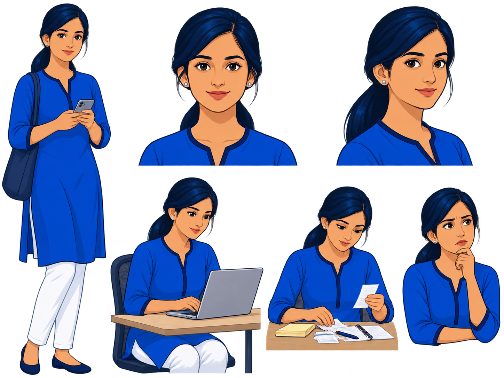
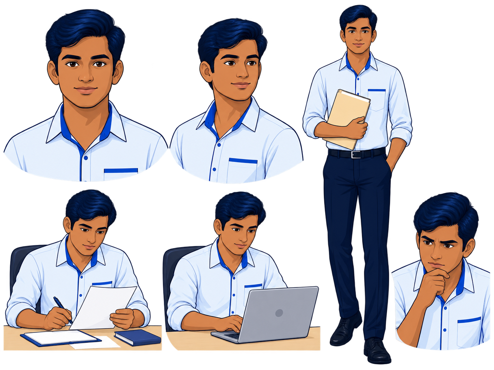
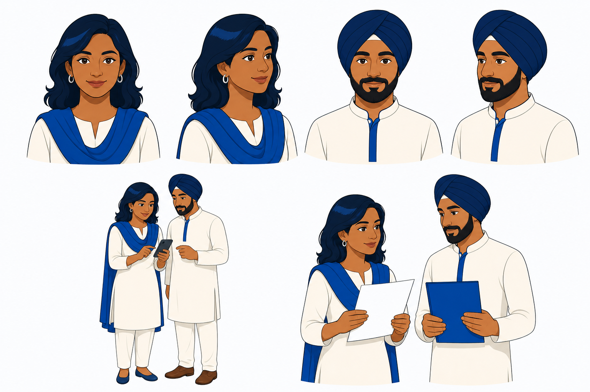
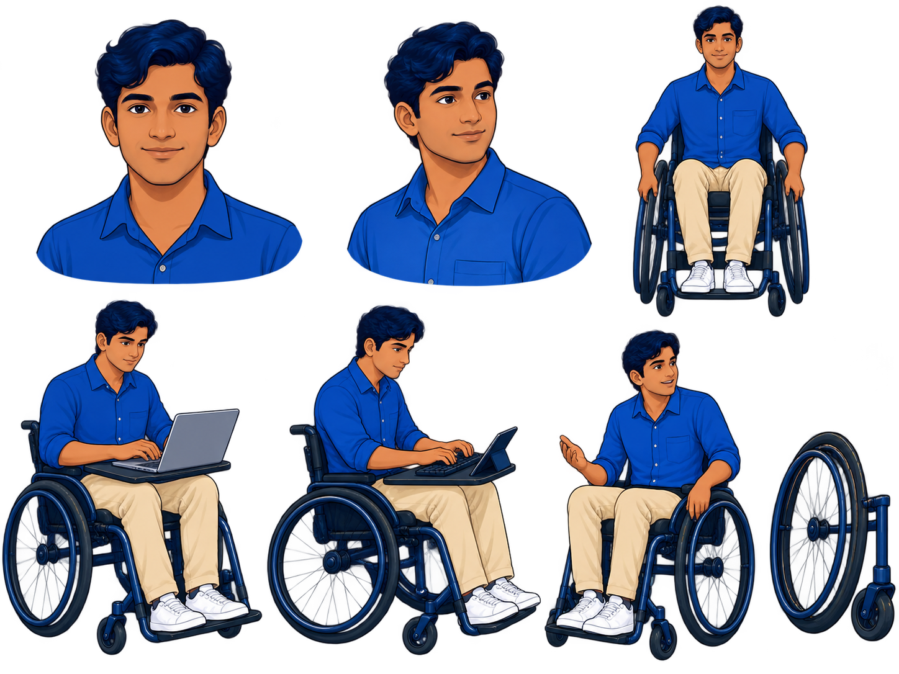

# ThreadZero V3 Proof Wave 01 Review

- **Generated:** 2026-08-28
- **Scope:** P01–P05 only
- **Reviewer status:** agent preflight complete; user decision required
- **Production status:** blocked

The five selected drafts are saved under `proofs/wave-01/`. They are proof candidates, not production assets and not website references.

Generation specifications, hashes, background checks, and rejected attempts are recorded in `WAVE_01_GENERATION_LOG.md`.

## Technical verification

| Proof | Dimensions | Background result | Agent decision |
|---|---:|---|---|
| P01 Character A | 1448×1086 | real alpha | REVISE |
| P02 Character B | 1448×1086 | real alpha | REVISE |
| P03 Community C/D | 1536×1024 | baked light canvas; corner values vary around `#FBFCFF` | REVISE |
| P04 Character E | 1448×1086 | real alpha | REVISE |
| P05 Object family | 1448×1086 | real alpha | REVISE |

## Selected proofs

### P01 — Character A

Retain:

- recognizable recurring identity;
- useful six-view layout;
- blue-kurta silhouette;
- preparation, laptop, and receipt actions.

Revise:

- reduce identity drift in the concerned-expression pose;
- simplify hair highlights;
- remove small colored alpha-edge artifacts;
- remove the unrequested tote bag;
- reduce portrait/beauty rendering.

### P02 — Character B

Retain:

- clean-shaven identity;
- evidence-folder, paper, and laptop actions;
- clear pale-shirt/navy-trouser silhouette.

Revise:

- simplify hair and face rendering to match P01's flatter target;
- correct expression-view identity drift;
- clean colored alpha fringes and desk-edge artifacts;
- reduce the semi-formal/office-uniform feeling.

### P03 — Community cast C/D

Retain:

- distinct C and D identities;
- respectful Sikh character construction;
- phone and printed-guidance interactions;
- improved light civic presentation over the rejected first draft.

Revise:

- replace the baked canvas with true alpha or exact flat `#FBFCFF`;
- remove subtle canvas variation;
- reduce the all-white ceremonial/formal impression;
- align facial and shading weight more closely with P01/P02.

### P04 — Character E

Retain:

- active, non-clinical representation;
- laptop, keyboard, and conversational task coverage;
- clear manual-wheelchair concept;
- real alpha background.

Revise:

- use one reproducible wheelchair construction in every pose;
- simplify wheel, spoke, and material rendering;
- reduce 3D depth and hair highlights;
- tighten facial identity across scale changes.

### P05 — Object family

Retain:

- complete twelve-object coverage;
- consistent blue/navy family;
- clear phone, laptop, message, receipt, folder, alert, and timeline silhouettes;
- real alpha background.

Revise:

- remove literal `A` characters from accessibility controls;
- flatten glossy highlights and deep shadows;
- simplify the contact-lost symbol and remove unnecessary red drama;
- standardize corner radii, outline thickness, and object depth;
- make the focus indicator unmistakable without raster text.

## User decision

Review the five proofs together and assign one status to each:

- `APPROVED`
- `REVISE`
- `REGENERATE`

P06–P08 remain blocked until P01–P05 establish one acceptable family.
