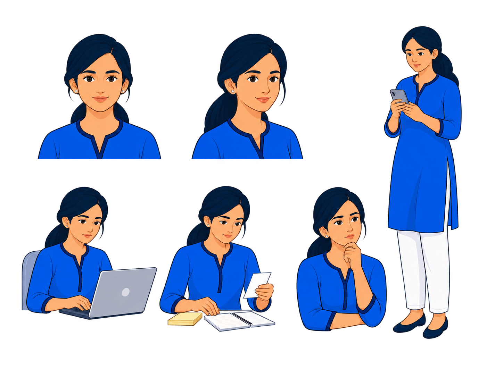
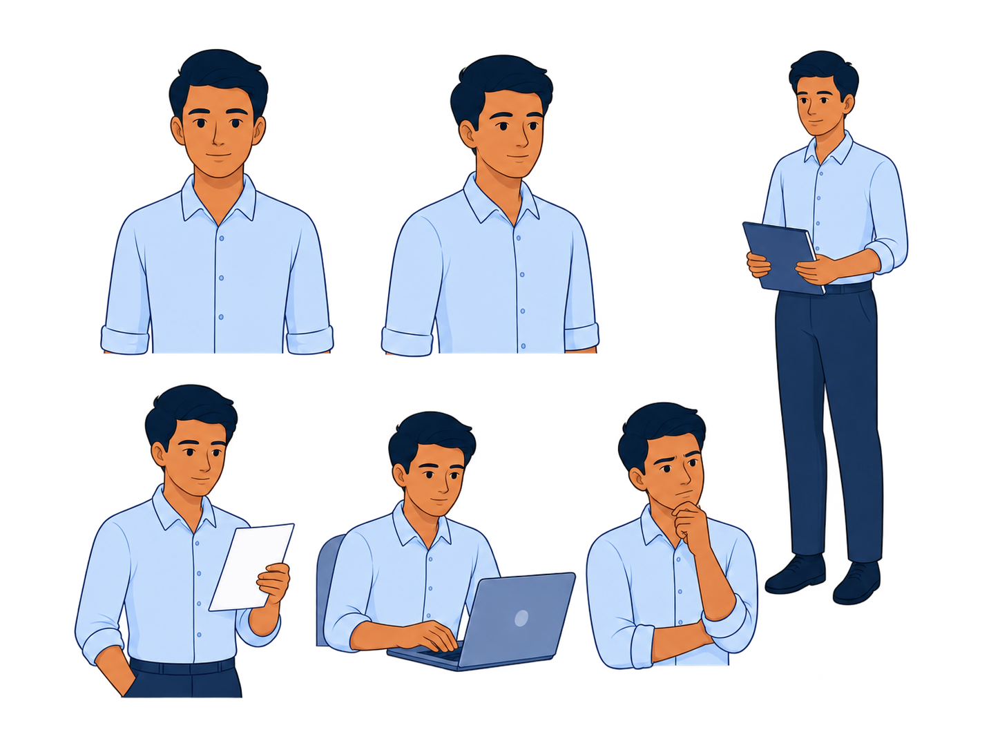
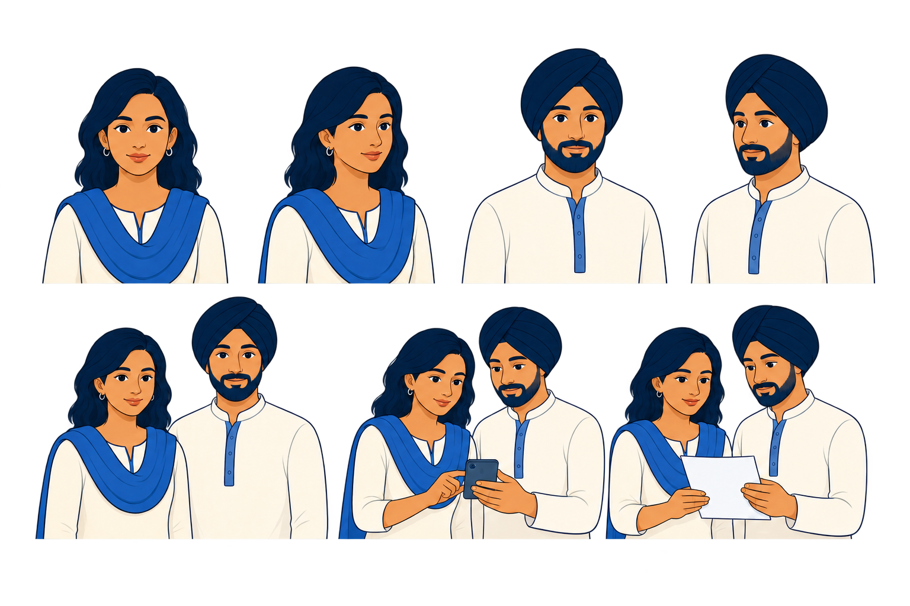
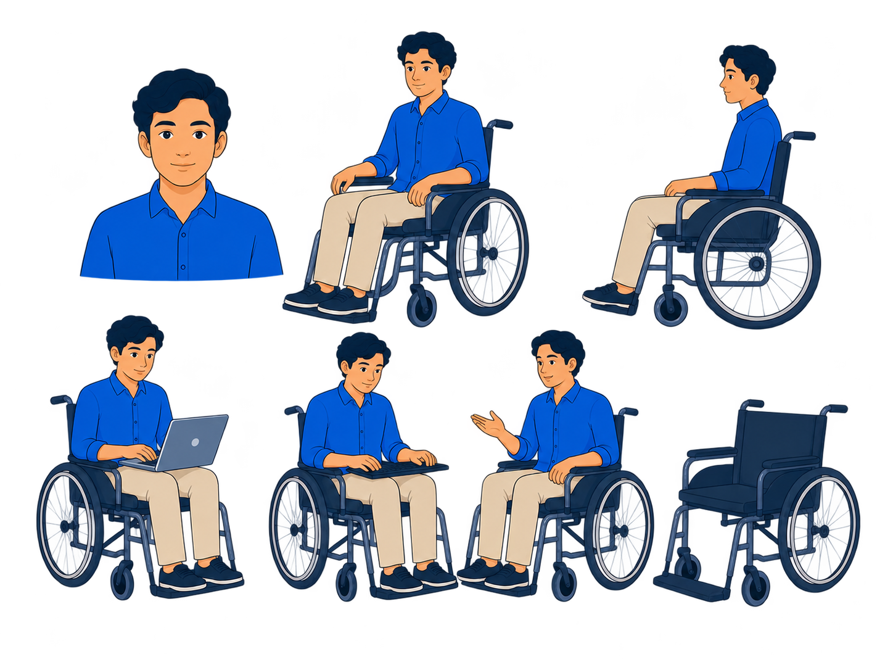

# ThreadZero V3 Wave 03 — P02–P05 Joint Review

- **Generated:** 2026-08-28
- **Mode:** built-in `image_gen`
- **Scope:** P02 Character B, P03 Characters C/D, P04 Character E, and P05 object family
- **Visual authorities used:** Illustration Style Master v1.0 and approved P01 Character A Master v1.0 only
- **Decision:** P02 `REVISE`; P03 `REGENERATE`; P04 `REVISE`; P05 `REVISE`
- **Production status:** blocked
- **Next-generation status:** P06–P08 blocked pending user review of P01–P05

## Authority boundary

Each initial generation used exactly two visual references:

1. `style-master-v1-faq-woman-laptop-reference.png` as the rendering authority;
2. `proofs/approved/P01-character-a-master-v1.png` as the family, anatomy, line, simplification, spacing, and model-sheet authority.

No prior P02–P05 attempt, Golden Screen, page screenshot, opaque checkerboard export, or production-site image was used as a visual reference. Background-only correction passes referenced only their own generated target and were not allowed to redesign it.

## Proof set

### P01 — approved authority

### P02 — Character B candidate

### P03 — Characters C and D candidate

### P04 — Character E candidate

### P05 — object-family candidate

## Technical verification

| Proof | Candidate file | Dimensions | Ratio | Pixel format | Background samples | SHA-256 |
|---|---|---:|---:|---|---|---|
| P01 | `proofs/approved/P01-character-a-master-v1.png` | 1448×1086 | 4:3 | 32-bit ARGB | corners `A=0` | `9B0C18EDAEC8D5698B2E3018F8B5D6564F8862CA2DC9C783525D87B17F4BF1E2` |
| P02 | `proofs/wave-03/P02-character-b-normalized-draft-01.png` | 1448×1086 | 4:3 | 32-bit ARGB | corner and center `A=0` | `5D2F30D132E0D4D942A46D0C3BE6DEB3F7F1DB9BF6F3B8AD94F16386591097FD` |
| P03 | `proofs/wave-03/P03-community-cd-normalized-draft-01.png` | 1536×1024 | 3:2 | 32-bit ARGB | corner and center `A=0` | `499C123FBD1EF724E252B9B1803F2B3FC11D330A9705EA3075A905AC875181F6` |
| P04 | `proofs/wave-03/P04-character-e-normalized-draft-01.png` | 1448×1086 | 4:3 | 32-bit ARGB | corner and center `A=0` | `79228F3DBD198351C3E3D9BA718B214FF35FB5215B28740D4CEBC33D7AA14D3C` |
| P05 | `proofs/wave-03/P05-object-family-normalized-draft-01.png` | 1448×1086 | 4:3 | 32-bit ARGB | corner and center `A=0` | `BDBEEC04BCD723CFAEB65241B22AAE76E954BF43209D22A1DF3EAC86926F9B6B` |

The technical alpha check establishes a transparent export, not visual approval. All four candidates still require review on the destination light canvas because the extraction passes leave small colored edge pixels around some contours.

## Joint family audit

| Gate | P01 | P02 | P03 | P04 | P05 |
|---|---|---|---|---|---|
| Correct scope and content | PASS | PASS | PASS | PASS | PASS |
| Required aspect ratio | PASS | PASS | PASS | PASS | PASS |
| Genuine alpha | PASS | PASS | PASS | PASS | PASS |
| Stable identity/object family | PASS | PASS | FAIL | PASS | PASS |
| Style Master simplification | PASS | REVISE | FAIL | REVISE | REVISE |
| Flat restrained shading | PASS | REVISE | FAIL | REVISE | FAIL |
| No authority/official cues | PASS | PASS | PASS | PASS | PASS |
| Clean destination-canvas edges | PASS | REVISE | REVISE | REVISE | REVISE |
| Agent preflight decision | APPROVED | REVISE | REGENERATE | REVISE | REVISE |

## Proof decisions

### P02 — `REVISE`

What works:

- one stable clean-shaven civilian identity across six useful views;
- pale-blue rolled-sleeve shirt and navy trousers remain non-authority clothing;
- clear folder, document, laptop, and focused-expression actions;
- exact 4:3 canvas with real alpha.

Required correction:

- simplify the eye, hair, face, and shirt shading to P01's quieter rendering level;
- reduce the full-body view's relative scale so the sheet reads as one balanced family;
- remove colored extraction-edge pixels without changing the identity or poses.

### P03 — `REGENERATE`

What works:

- respectful ordinary-citizen Sikh representation;
- stable turban and clothing language;
- useful paired phone and document scenes;
- correct 3:2 canvas with real alpha.

Blocking defects:

- Character C does not read as the locked darker S4 complexion relative to D;
- both faces use more beauty-rendering, eye detail, and hair gloss than P01;
- C risks reading as a polished variation of Character A rather than a distinct recurring identity;
- the paired cast therefore fails the family/identity gate and needs a fresh generation, not a local edit.

### P04 — `REVISE`

What works:

- active everyday representation without medical, charity, or inspiration framing;
- coherent manual-wheelchair concept across the task poses;
- full chair, laptop, keyboard, conversation, and chair-detail views are present;
- exact 4:3 canvas with real alpha.

Required correction:

- simplify spokes, frame joints, and mechanical rendering to match the character's detail budget;
- simplify face and shirt shading to the P01 level;
- retain the current active poses and chair identity while cleaning colored extraction edges.

### P05 — `REVISE`

What works:

- strong coverage of phone, laptop, browser, message, link, receipt, payment, SIM, document, evidence image, notification, warning, success, timeline, keyboard, focus, and size controls;
- coherent navy/cobalt geometry and readable small-object silhouettes;
- no logo, official identity, shield, or lock;
- exact 4:3 canvas with real alpha.

Required correction:

- replace gradient/gloss rendering with the Style Master's flat fill and one restrained shadow plane;
- simplify browser pseudo-content and payment marks so they remain clearly abstract;
- normalize outline weight and remove colored extraction-edge pixels.

## Attempt provenance

| Proof | Attempt | Result | SHA-256 | Workspace disposition |
|---|---|---|---|---|
| P02 | Initial generation | 1448×1086 opaque RGB with baked checkerboard | `EA6DBD5E1D9CAB8AA20EC26DB8A540C1B42E1985112D1D98F72719DB1CADED02` | not copied |
| P02 | Background extraction | valid 4:3 ARGB candidate | `5D2F30D132E0D4D942A46D0C3BE6DEB3F7F1DB9BF6F3B8AD94F16386591097FD` | saved as Wave 03 candidate |
| P03 | Initial generation | 1536×1024 opaque RGB with baked checkerboard | `CC61C1B5731491FF200C508D15CC90DE9920970B7C86359961256DB5BE1312F0` | not copied |
| P03 | Extraction attempt 1 | remained opaque RGB | `56216C984B4F47D930F8C5F619FFBE0B6CFCE57A8F921DF1005D38B49268A1B7` | not copied |
| P03 | Extraction attempt 2 | valid 3:2 ARGB review candidate; visual identity gate fails | `499C123FBD1EF724E252B9B1803F2B3FC11D330A9705EA3075A905AC875181F6` | saved as Wave 03 candidate |
| P04 | Initial generation | 1448×1086 opaque RGB with baked checkerboard | `B753FD0611C6B7F9CE03BB7E66BC7C35B87FAD4E3CB1EFFF5EEAA67E32AD2A30` | not copied |
| P04 | Extraction attempt 1 | remained opaque RGB | `C2E8EAE95B49E9918E7C655FF999B7E2D08E5E7A2A2489C7E62400D77B281C6B` | not copied |
| P04 | Extraction attempt 2 | valid 4:3 ARGB candidate | `79228F3DBD198351C3E3D9BA718B214FF35FB5215B28740D4CEBC33D7AA14D3C` | saved as Wave 03 candidate |
| P05 | Initial generation | 1448×1086 opaque RGB with baked checkerboard | `2CB8EEC73B7B40FE6FF3529816A03A07252BD1746A5889FF570B1BD0660618C2` | not copied |
| P05 | Background extraction | valid 4:3 ARGB candidate | `BDBEEC04BCD723CFAEB65241B22AAE76E954BF43209D22A1DF3EAC86926F9B6B` | saved as Wave 03 candidate |

Opaque and failed extraction attempts remain in the generation provider's immutable output history only. They must never be used as references for later generation.

## Stop gate

Wave 03 stops here. No P06 Evidence Thread, P07 editorial scene, P08 media-cover family, Golden Screen, CSS, route, or website production work is authorized by this review.

The user must assign or confirm `APPROVED`, `REVISE`, or `REGENERATE` for P02–P05. Only approved masters may condition the next proof wave.
