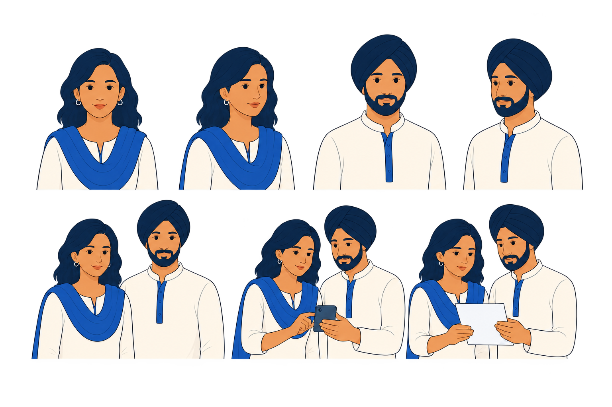
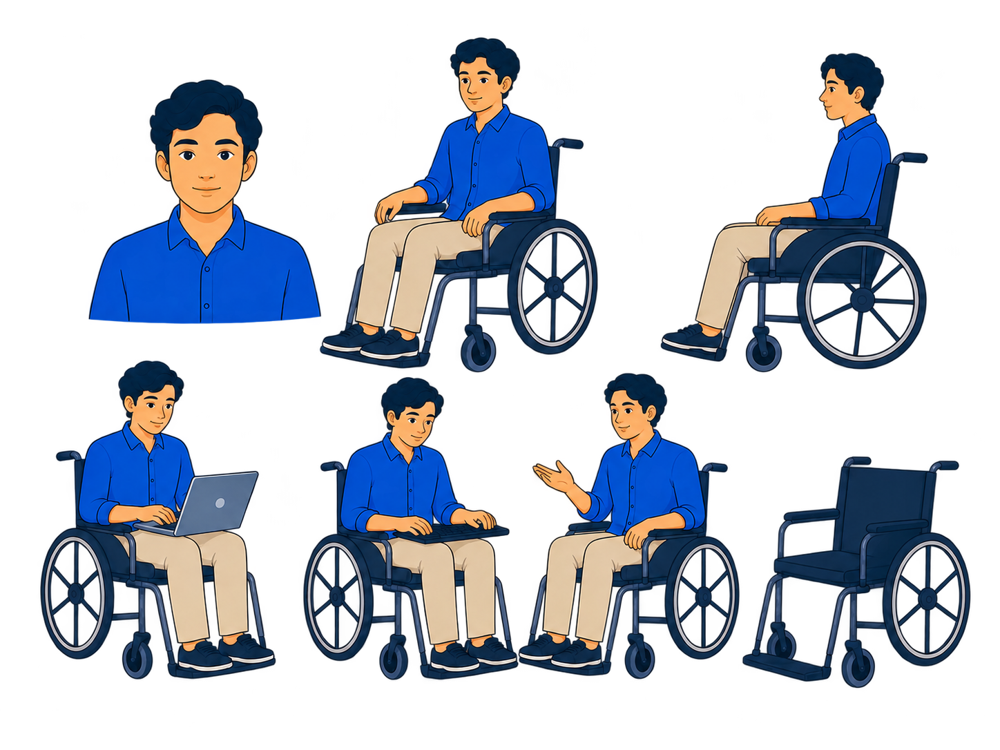

# ThreadZero V3 Wave 04 — Final Normalization Review

- **Generated:** 2026-08-28
- **Mode:** built-in `image_gen`
- **Scope:** P03, P04, and P05 only
- **Frozen before generation:** P01 Character A Master v1.0 and P02 Character B Master v1.0
- **Current decision:** P03–P05 ready for user `APPROVED` or `REVISE` review
- **Production status:** blocked
- **Next-wave status:** P06–P08 blocked

## Approved masters preserved

| Proof | Master | SHA-256 |
|---|---|---|
| P01 | `proofs/approved/P01-character-a-master-v1.png` | `9B0C18EDAEC8D5698B2E3018F8B5D6564F8862CA2DC9C783525D87B17F4BF1E2` |
| P02 | `proofs/approved/P02-character-b-master-v1.png` | `5D2F30D132E0D4D942A46D0C3BE6DEB3F7F1DB9BF6F3B8AD94F16386591097FD` |

P01 and P02 were not regenerated or edited during Wave 04.

## Three review candidates

### P03 — Characters C and D

### P04 — Character E and wheelchair family

### P05 — object family

## Technical verification

| Proof | Dimensions | Ratio | Pixel format | Transparent samples | SHA-256 |
|---|---:|---:|---|---|---|
| P03 | 1536×1024 | 3:2 | 32-bit ARGB | corner and center `A=0` | `8F6B0D292F9CDE3351AC26A76BB381991A2AF43B715BBEB7663496F3BAFD185C` |
| P04 | 1448×1086 | 4:3 | 32-bit ARGB | corner and center `A=0` | `6928675B2299E08060F109DBD98A9E45D092F16BE72C8134496E71B1130B686A` |
| P05 | 1448×1086 | 4:3 | 32-bit ARGB | corner and center `A=0` | `3A7D333DB2CE8DBD14437BE128B3973CC8A25372B125A17DB7704D0DECA96A9F` |

Each candidate was composited at full size on the destination page canvas `#FBFCFF`. No visible checkerboard, opaque rectangle, matte field, or extraction halo remained. P01–P05 were also reviewed together at approximately 320px proof width.

## Normalization results

### P03

- preserved both identities, garments, poses, phone scene, document scene, scale, and layout;
- simplified eyes, eyelashes, lips, facial contours, hair, and beard detail;
- removed the previous beauty-render emphasis;
- strengthened the darker-complexion distinction for Character C;
- retained respectful ordinary-citizen Sikh representation;
- exported as exact 3:2 with genuine alpha.

### P04

- preserved Character E, blue shirt, beige trousers, poses, laptop, keyboard, and conversational action;
- reduced wheelchair mechanics by roughly half;
- replaced dense spokes with six-to-eight-spoke wheels, simple hubs, one readable rim, and a cleaner frame;
- kept one coherent wheelchair identity across every view;
- retained active everyday framing without clinical or inspirational cues;
- exported as exact 4:3 with genuine alpha.

### P05

- preserved the complete approved object inventory and grid;
- removed most glossy highlight, extrusion, bevel, and heavy depth;
- normalized pale-blue, cobalt, navy, white, and success-only teal usage;
- retained recognizable small-scale silhouettes and coherent outline weight;
- contains no words, letters, logos, shields, locks, or official identity;
- exported as exact 4:3 with genuine alpha.

## Generation provenance

| Proof | Attempt | Result | SHA-256 | Disposition |
|---|---|---|---|---|
| P03 | controlled identity-preserving normalization | correct 3:2 composition; opaque checkerboard export | `207FB59530E791A7DBE210716186C5AB4BD1F0B2525B08E1F71D0AC7EE578128` | not copied |
| P03 | background-only extraction | genuine-alpha review candidate | `8F6B0D292F9CDE3351AC26A76BB381991A2AF43B715BBEB7663496F3BAFD185C` | saved as Wave 04 draft 02 |
| P04 | controlled wheelchair simplification | correct 4:3 composition; opaque checkerboard export | `971266A7D1B0450CCD59AFFF3624C58C609FE17687E846BB5334EC67F5C7E65F` | not copied |
| P04 | background-only extraction | genuine-alpha review candidate | `6928675B2299E08060F109DBD98A9E45D092F16BE72C8134496E71B1130B686A` | saved as Wave 04 draft 02 |
| P05 | controlled flat-render normalization | correct 4:3 composition; opaque checkerboard export | `6301B388A6BF00B69ECADEDD229B7C6EE02E8D362279F1B42145BA8EDF3654E4` | not copied |
| P05 | background-only extraction | genuine-alpha review candidate | `3A7D333DB2CE8DBD14437BE128B3973CC8A25372B125A17DB7704D0DECA96A9F` | saved as Wave 04 draft 02 |

Opaque attempts remain only in the generation provider's immutable output history and must never condition later work.

## Authority used

The normalization calls used each selected Wave 03 image as the edit target, plus Style Master v1.0 and approved P01/P02 as rendering authorities. The background-extraction calls used only their own normalized target and were prohibited from redesigning it.

## Stop gate

Wave 04 stops here. P03, P04, and P05 remain review candidates until the user assigns `APPROVED` or `REVISE` to each. They must not be copied into `proofs/approved/` before that decision.

No P06 Evidence Thread, P07 editorial scene, P08 media family, Golden Screen, route, CSS, JavaScript, or website implementation work is authorized by this review.
