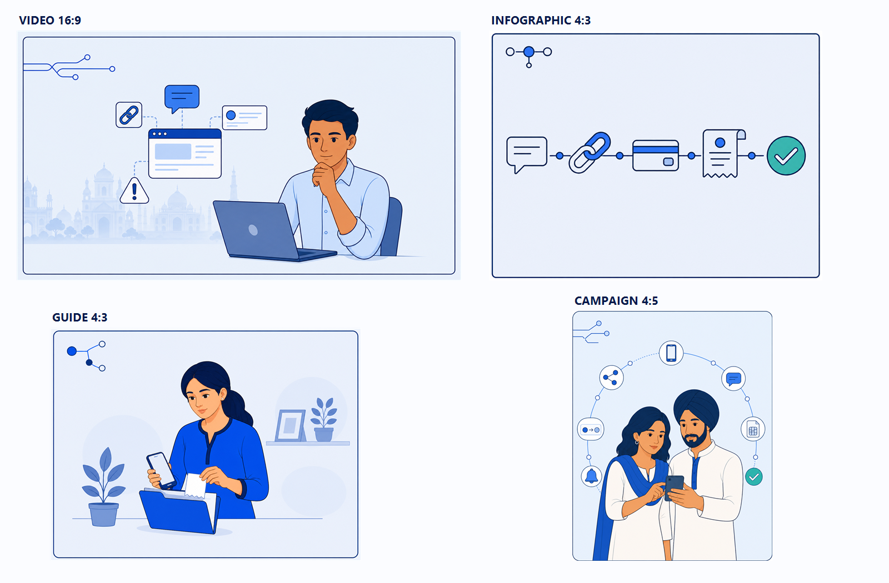

# ThreadZero V3 Wave 05 — P06–P08 Review

- **Generated:** 2026-08-28
- **Mode:** built-in `image_gen`
- **Scope:** P06 Evidence Thread, P07 editorial scene, and P08 four-cover media family
- **Input authorities:** approved P01–P05 plus Illustration Style Master v1.0
- **Decision:** APPROVED AND PROMOTED TO ILLUSTRATION SYSTEM V1.0
- **Website implementation:** not started by this wave

## P06 — Evidence Thread

The final sequence reads without raster labels:

`message → suspicious link → payment → evidence/receipt → lost contact → next action`

- six equal, separable nodes;
- one continuous connector grammar;
- P05 object construction and palette;
- positive teal reserved for the final action;
- no character, fake interface panel, readable text, or official mark;
- 1672×941 near-16:9 ARGB with real alpha;
- SHA-256 `04340491F311474C5872F0D36093C331E527BD13A0183EC8D01659D2CF7DFC52`.

## P07 — Editorial website scene

- Character A preparing a laptop, phone, receipt, and folder;
- right-weighted subject group with approximately 65–70% quiet left field;
- pale workspace context fades into transparency;
- no monument, hard image rectangle, raster text, or official cue;
- 1672×941 near-16:9 ARGB with real alpha;
- SHA-256 `7B396B89229CCB23536490CFC0DC8FC3C123D30A428605DAA75A290C6A422DD8`.

## P08 — Media Library publisher family

| Cover | Approved production file | Dimensions | SHA-256 |
|---|---|---:|---|
| Video | `proofs/approved/P08-media-video-cover-v1.png` | 1672×941 near-16:9 | `32AF8ACD40572A2865BC1FE30378FCD0E166A0833B3C0392653721222A1116A1` |
| Infographic | `proofs/approved/P08-media-infographic-cover-v1.png` | 1448×1086 4:3 | `16DF3E870C47E99EAD79D28059C341C5A7FD10BE87A72D226DF9DAA815552BB4` |
| Guide | `proofs/approved/P08-media-guide-cover-v1.png` | 1448×1086 4:3 | `0ADF72741B255D0F09F9FA0BE50CE681AAD47CFD4647CE5F92B9BC06C8ECC4BC` |
| Awareness campaign | `proofs/approved/P08-media-campaign-cover-v1.png` | 1122×1402 near-4:5 | `2985C33F3B6FA611B24D4E670A1BA9FA8D73A6B74F9EEE11ACB93AA324CBAE3F` |

All four share a thin navy crop border, cobalt corner-thread motif, pale publisher field, flat approved character/object language, minimal shadow, and no raster title or metadata. The compositions remain distinct. The video cover alone uses the permitted subtle city/monument cue.

## Attempt provenance

| Proof | Attempt | Result | SHA-256 | Disposition |
|---|---|---|---|---|
| P06 | initial controlled generation | passed content, alpha, and near-16:9 gates | `04340491F311474C5872F0D36093C331E527BD13A0183EC8D01659D2CF7DFC52` | approved |
| P07 | initial editorial generation | real alpha but insufficient quiet field and facial-detail drift | `24285C5C7653E2E60E709C18AE0416DBD80FD3AE21EECA2F17CC6B764F764014` | not copied |
| P07 | composition/identity correction | correct composition but opaque checkerboard export | `DF3B5A90A8E60D905FFD33277629B9E2426C80DAA97C08C39CCE7D1E2260C493` | not copied |
| P07 | background-only extraction | passed alpha and composition gates | `7B396B89229CCB23536490CFC0DC8FC3C123D30A428605DAA75A290C6A422DD8` | approved |
| P08 | combined-board generation | coherent family but wrong internal guide/campaign ratios | `16B299E2B7AF4B70E33D401C38A2A8CA4854072B83F5395E7EDEA2E1AE7E3BE9` | not copied |
| P08 | combined-board ratio correction | still failed exact internal ratios | `C4866E912D6DFFD5515A9010B6292BC883F8994CED6BA5562DF7DABF69502D05` | not copied |
| P08 | four individual production generations | exact external formats and coherent publisher family | hashes listed above | approved |

Opaque or rejected generation attempts remain only in the provider's immutable output history and must never condition implementation.

## Final P01–P08 gate

The combined desktop and thumbnail review passed:

- rendering simplicity;
- navy/cobalt palette;
- shared outline language;
- face abstraction;
- restrained shadow depth;
- alpha integration for P01–P07;
- intentional P08 cover fields;
- no baked checkerboard;
- no readable raster title or metadata;
- no government identity or unsupported official claim.

## Stop gate

Illustration generation stops here. P01–P08 are frozen as Illustration System v1.0. The next authorized step is an isolated-worktree baseline followed by shared tokens/shell and the real Home vertical slice. No route-wide rollout, deployment, submission, push, or merge is authorized by this review.
